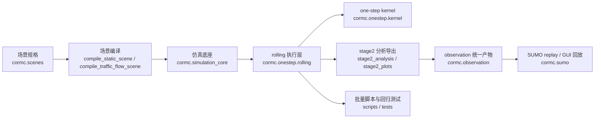
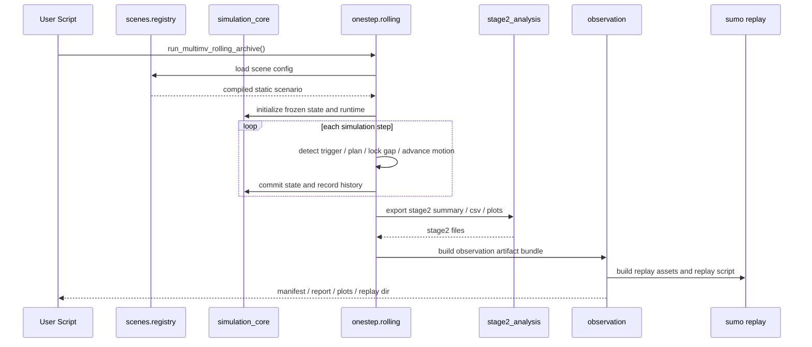

# CORMC 架构文档

## 1. 文档定位

这份文档解决 4 个问题：

1. 这个仓库从整体上是怎么分层的
2. 一个场景从“定义”到“rolling 执行”再到“图表与 replay”会经过哪些模块
3. 各目录分别负责什么，不该负责什么
4. 如果别人只想复用 rolling 算法，不想带上场景接口、数据收集、分析、SUMO、replay，应该怎么读代码、怎么接入

这份文档不讲算法公式细节，只讲结构、职责、依赖关系和接入路径。

## 2. 系统总览



从职责上看，它不是一个单纯的“算法包”，而是一个实验工作台：

- `scenes` 负责把“我要测什么场景”表达清楚
- `simulation_core` 负责把仿真一步一步推进下去
- `onestep/rolling` 负责在合适时机做 rolling 决策
- `observation` 负责把结果变成可检查的产物
- `sumo` 负责把轨迹变成 GUI 可回放的离线 replay

## 3. 代码分层

### 3.1 `cormc/scenes`

这是“统一场景接口层”。

主要职责：

- 定义静态场景和流量场景
- 给每个场景分配稳定的 `scenario_id`
- 把场景规格编译成仿真可直接消费的配置

关键入口：

- [`cormc/scenes/registry.py`](../cormc/scenes/registry.py)
- [`cormc/scenes/multimv.py`](../cormc/scenes/multimv.py)
- [`cormc/scenes/compiler.py`](../cormc/scenes/compiler.py)

这里解决的是“输入统一”的问题，而不是“rolling 怎么算”的问题。

### 3.2 `cormc/simulation_core`

这是“仿真底座层”。

主要职责：

- 维护车辆状态与场景状态
- 推进一步仿真
- 记录轨迹、事件、检查项
- 产出后续分析所需的历史数据

关键文件：

- [`cormc/simulation_core/engine.py`](../cormc/simulation_core/engine.py)
- [`cormc/simulation_core/loop.py`](../cormc/simulation_core/loop.py)
- [`cormc/simulation_core/recording.py`](../cormc/simulation_core/recording.py)
- [`cormc/simulation_core/commit.py`](../cormc/simulation_core/commit.py)
- [`cormc/simulation_core/pre_freeze.py`](../cormc/simulation_core/pre_freeze.py)

这一层不关心“为什么这样合流更好”，它负责“把这一步真实落地并留下记录”。

### 3.3 `cormc/onestep/kernel`

这是“one-step 评估内核层”。

主要职责：

- 提供 rolling 决策所需的底层评估能力
- 封装 reachability、trajectory、gaps、timing scoring、cooperation 等核心逻辑
- 作为 rolling planner 的底层计算支撑

关键文件：

- [`cormc/onestep/kernel/evaluation.py`](../cormc/onestep/kernel/evaluation.py)
- [`cormc/onestep/kernel/reachability.py`](../cormc/onestep/kernel/reachability.py)
- [`cormc/onestep/kernel/trajectory.py`](../cormc/onestep/kernel/trajectory.py)
- [`cormc/onestep/kernel/timing_scoring.py`](../cormc/onestep/kernel/timing_scoring.py)
- [`cormc/onestep/kernel/gaps.py`](../cormc/onestep/kernel/gaps.py)

这一层更接近“单次决策评估器”，不是完整实验流程入口。

### 3.4 `cormc/onestep/rolling`

这是“rolling 算法层”，也是本仓库最核心的一层。

主要职责：

- 管理 rolling 运行时状态
- 识别何时触发 rolling 计划
- 评估 gap 候选
- 生成当前计划、锁定 gap、推进 lateral / merge 生命周期
- 输出可验证的 round summary / MV lifecycle / cross-MV diagnostics

推荐从这里开始读：

- [`cormc/onestep/rolling/__init__.py`](../cormc/onestep/rolling/__init__.py)
- [`cormc/onestep/rolling/stage2_runner.py`](../cormc/onestep/rolling/stage2_runner.py)
- [`cormc/onestep/rolling/stage2_multimv_runner.py`](../cormc/onestep/rolling/stage2_multimv_runner.py)

核心模块分工：

- [`state.py`](../cormc/onestep/rolling/state.py)：运行时状态、plan bundle、gap ref、控制状态
- [`engine.py`](../cormc/onestep/rolling/engine.py)：rolling 每步推进总控
- [`planner.py`](../cormc/onestep/rolling/planner.py)：计划决策与 trigger / merge 逻辑
- [`motion.py`](../cormc/onestep/rolling/motion.py)：轨迹推进与运动输出
- [`safety.py`](../cormc/onestep/rolling/safety.py)：可控性与安全检查
- [`gaps.py`](../cormc/onestep/rolling/gaps.py)：gap 识别与编号
- [`stage2_adapter.py`](../cormc/onestep/rolling/stage2_adapter.py)：把 rolling 与 one-step kernel 对接起来
- [`validation.py`](../cormc/onestep/rolling/validation.py)：接受性检查与 cross-MV 诊断

### 3.5 `cormc/observation`

这是“结果整理与统一观察产物层”。

主要职责：

- 读取 stage2 输出
- 生成统一命名的 plots
- 生成 replay 数据与 manifest / report
- 暴露统一 CLI

关键入口：

- [`cormc/observation/cli.py`](../cormc/observation/cli.py)
- [`cormc/observation/artifacts.py`](../cormc/observation/artifacts.py)
- [`cormc/observation/plotting.py`](../cormc/observation/plotting.py)
- [`cormc/observation/sumo_replay.py`](../cormc/observation/sumo_replay.py)

这一层不参与算法决策，只负责把结果变成“人能检查、SUMO 能回放”的标准产物。

### 3.6 `cormc/sumo`

这是“SUMO 适配与回放层”。

主要职责：

- 处理 SUMO 相关配置、网络、命令和执行
- 生成 GUI replay 所需文件
- 承接 observation 的离线轨迹回放

关键文件：

- [`cormc/sumo/trajectory_gui_replay.py`](../cormc/sumo/trajectory_gui_replay.py)
- [`cormc/sumo/network.py`](../cormc/sumo/network.py)
- [`cormc/sumo/commands.py`](../cormc/sumo/commands.py)
- [`cormc/sumo/executor.py`](../cormc/sumo/executor.py)

如果你不关心 replay 和 GUI，这一层可以后看，甚至先完全忽略。

### 3.7 `scripts`

这是“人手直接执行的入口层”。

目前最关键的入口是：

- [`scripts/run_multimv_rolling.py`](../scripts/run_multimv_rolling.py)

它做的是：

- 按场景列表跑多 MV rolling
- 自动输出批次级 `manifest/csv/report`
- 每个场景再自动输出 stage2 和 stage8 产物

### 3.8 `tests`

这是“行为契约层”。

建议把测试文件看作一种压缩过的规格文档：

- [`tests/test_multimv_rolling_batch.py`](../tests/test_multimv_rolling_batch.py)：批量执行与输出契约
- [`tests/test_observation_artifacts.py`](../tests/test_observation_artifacts.py)：observation 产物契约
- `test_ramp_merge_onestep_stage2_*`：rolling stage2 行为边界
- `test_p17_sumo_*`：SUMO 相关适配边界

## 4. 典型执行链路

### 4.1 全量实验链路

以 `scripts/run_multimv_rolling.py --scenario-id RM-M2-S01` 为例，链路是：



### 4.2 输出目录约定

多 MV 批量执行的输出根目录结构是固定的：

```text
<output_root>/
├─ multimv_run_manifest.json
├─ multimv_summary.csv
├─ multimv_report.md
└─ <scenario_id>/
   └─ <run_id>/
      ├─ stage2_summary.json
      ├─ stage2_report.md
      ├─ trajectory.csv
      ├─ gap_rows.json
      ├─ process_x_t_local.png
      ├─ process_v_t.png
      ├─ process_y_t.png
      ├─ lifecycle_timeline.png
      ├─ stage8_artifact_manifest.json
      ├─ stage8_report.md
      ├─ stage8_plots/
      └─ stage8_sumo_replay/
```

可以把这些文件分成 3 类：

1. 执行摘要
   - `multimv_run_manifest.json`
   - `multimv_summary.csv`
   - `multimv_report.md`
2. rolling 过程产物
   - `stage2_summary.json`
   - `stage2_report.md`
   - `trajectory.csv`
   - `gap_rows.json`
   - `process_*.png`
3. observation / replay 产物
   - `stage8_artifact_manifest.json`
   - `stage8_report.md`
   - `stage8_plots/`
   - `stage8_sumo_replay/`

## 5. 算法模块说明

这里只说明职责，不展开算法细节。

### 5.1 rolling 层在做什么

rolling 层不是“一次算完一个场景”，而是每一步都在回答几个问题：

1. 现在是否到了应该触发规划的时机
2. 当前 MV 可以考虑哪些 gap
3. 哪个 gap 可以锁定，哪个不能碰
4. 当前控制状态是否安全、是否可控
5. 锁定后如何推进 longitudinal / lateral / merge 生命周期

所以这层更像一个“在线运行时控制器”，而不是一次性离线求解器。

### 5.2 stage2 runner 在做什么

`stage2_runner.py` 的价值不在于算法细节，而在于把一次 rolling history 跑成稳定的结构化输出：

- `scenario_summary`
- `round_summaries`
- `mv_summaries`
- `cross_mv_summary`

这意味着你不必先看内部所有状态机细节，就能先从 summary 读出：

- 每轮发生了什么
- 每个 MV 最终走到了哪一步
- 是否出现了 cross-MV 冲突

### 5.3 validation 在做什么

`validation.py` 不是重跑算法，而是对已经跑出来的结果做一致性检查，例如：

- 有没有多辆 MV 抢同一个 gap
- gap frontier 是否被倒退穿越
- 控制归属有没有冲突

它的定位更像“结果验收层”。

## 6. 只使用 Rolling 算法时的最短路径

这是这份文档最重要的一节。

很多人并不需要完整工作流，他们只想：

- 看 rolling 算法本体
- 复用 rolling 决策逻辑
- 忽略场景接口、数据收集、绘图、SUMO、replay

这时不应该从仓库最外层往里硬啃，而应该按下面的路线进入。

### 6.1 最短阅读路径

按顺序读：

1. [`cormc/onestep/rolling/__init__.py`](../cormc/onestep/rolling/__init__.py)
   - 先看公开暴露了哪些对象，建立目录感
2. [`cormc/onestep/rolling/stage2_runner.py`](../cormc/onestep/rolling/stage2_runner.py)
   - 看“一次 rolling history 是怎么被组织起来的”
3. [`cormc/onestep/rolling/engine.py`](../cormc/onestep/rolling/engine.py)
   - 看每一步推进的总控
4. [`cormc/onestep/rolling/planner.py`](../cormc/onestep/rolling/planner.py)
   - 看什么时候触发、怎么形成计划
5. [`cormc/onestep/rolling/motion.py`](../cormc/onestep/rolling/motion.py)
   - 看计划如何落成运动输出
6. [`cormc/onestep/rolling/safety.py`](../cormc/onestep/rolling/safety.py) + [`gaps.py`](../cormc/onestep/rolling/gaps.py)
   - 看安全和 gap 层的输入输出
7. [`cormc/onestep/rolling/state.py`](../cormc/onestep/rolling/state.py)
   - 最后补 runtime state 的对象结构
8. [`cormc/onestep/kernel`](../cormc/onestep/kernel)
   - 当你需要看更底层评估逻辑时再下钻

### 6.2 可以先忽略哪些模块

如果只想理解 rolling 算法本体，第一轮完全可以先不看：

- [`cormc/observation`](../cormc/observation)
- [`cormc/sumo`](../cormc/sumo)
- [`scripts/run_multimv_rolling.py`](../scripts/run_multimv_rolling.py)
- 大部分 `docs/` 下的 replay 和环境说明
- `legacy/` 目录

对于 `cormc/scenes`，可以分两种看法：

- 如果你只是读算法原理，先忽略
- 如果你想最快跑出一个现成例子，再回来用它提供的 `scenario_id`

### 6.3 最小使用路径

#### 路线 A：最低门槛，先借用现成场景

这是推荐的第一步。虽然它借用了场景接口，但理解成本最低。

```python
from cormc.onestep.rolling import run_onestep_stage2_history

result = run_onestep_stage2_history(
    "RM-M2-S01",
    max_steps=600,
    run_id="demo_history",
)

summary = result.summary
print(summary["scenario_summary"]["scenario_id"])
print(summary["scenario_summary"]["actual_steps"])
print(summary["cross_mv_summary"]["gap_conflicts"])
```

这条路径适合：

- 先理解 rolling 输出结构
- 快速看 `round_summaries / mv_summaries / cross_mv_summary`
- 不急着自己造输入

#### 路线 B：真正嵌入你自己的系统

如果你不想依赖本仓库的场景接口，那么更合适的接入点是：

- [`cormc/onestep/rolling/engine.py`](../cormc/onestep/rolling/engine.py) 中的 `RampMergeEngine`
- [`cormc/onestep/rolling/state.py`](../cormc/onestep/rolling/state.py) 中的运行时状态初始化能力

也就是说，把仓库拆开后，真正值得嵌入你自己系统的核心契约是：

1. 你自己准备仿真输入状态
2. 初始化 rolling runtime state
3. 逐步调用 engine 推进一步
4. 消费 `RampMergeStepResult`

这种方式的优点是：

- 不需要绑定本仓库的批量脚本
- 不需要绑定 observation / replay
- 你可以把 rolling 当成一个“每步给出控制结果的运行时模块”

但它也意味着你要自己承担：

- 输入状态组织
- 外层仿真时序
- 历史记录持久化
- 结果可视化

### 6.4 我建议的实际方案

如果别人说“我只想用 rolling 算法”，最稳的落地方案通常不是一步到位完全脱离仓库，而是分两段：

1. 先用路线 A，跑一个现成场景，搞清楚 rolling 输入输出契约
2. 再用路线 B，把 `RampMergeEngine` 嵌进自己的上层系统

原因很简单：

- 直接从 `engine` 硬接入，理解成本高
- 直接看 `kernel`，又太底
- 先看 `stage2_runner`，最容易知道“这个算法到底对外吐什么”

## 7. 给只想复用 Rolling 的人单独方案

如果你要把这个仓库拆给别人，只想交付 rolling 能力，不想交付整套实验工作台，我建议这样整理说明：

### 7.1 交付边界

保留：

- `cormc/onestep/rolling`
- `cormc/onestep/kernel`
- 必要的 `cormc/simulation_core` 状态与记录依赖

不作为第一批交付重点：

- `cormc/observation`
- `cormc/sumo`
- `scripts/`
- 批量 artifact 目录

### 7.2 对外解释方式

不要把 rolling 描述成“一个完整实验仓库”，而要描述成：

- 一个在线 rolling 合流决策模块
- 接收当前仿真状态
- 在触发时形成计划并推进生命周期
- 以 step result / summary 的形式输出行为记录

### 7.3 对外给的最小示例

给别人看的示例不要从 replay 开始，也不要从 21 场景批处理开始，而应该从这个级别开始：

```python
from cormc.onestep.rolling import run_onestep_stage2_history

result = run_onestep_stage2_history("RM-M2-S01", run_id="read_api")
print(result.summary["round_summaries"][0].keys())
print(result.summary["mv_summaries"].keys())
```

别人先看懂输出结构，才知道后面该不该继续接 `engine`。

## 8. 维护建议

### 8.1 新增场景时

优先保证：

- `scenario_id` 稳定
- `scenes` 入口统一
- 输出目录结构不变

不要让新场景绕开 `registry.py` 形成第二套入口。

### 8.2 改 rolling 逻辑时

优先保护：

- `stage2_summary.json` 的整体结构
- `round_summaries / mv_summaries / cross_mv_summary` 的语义稳定性
- `validation` 的诊断口径

因为外部分析、观察产物和很多测试都依赖这层契约。

### 8.3 改 observation / replay 时

优先保护：

- `stage8_artifact_manifest.json`
- `stage8_report.md`
- `stage8_plots/`
- `stage8_sumo_replay/`

它们已经是人查结果和 GUI 回放的稳定落点。

## 9. 一句话总结

CORMC 可以被看成两套东西叠在一起：

1. 一套完整的场景到产物的实验流水线
2. 一套可单独抽出来复用的 rolling 合流运行时

如果你是第一次接手代码，先从完整链路理解；如果你只想复用 rolling，就把注意力收缩到 `cormc/onestep/rolling -> cormc/onestep/kernel -> 必要的 simulation_core` 这条线上。
